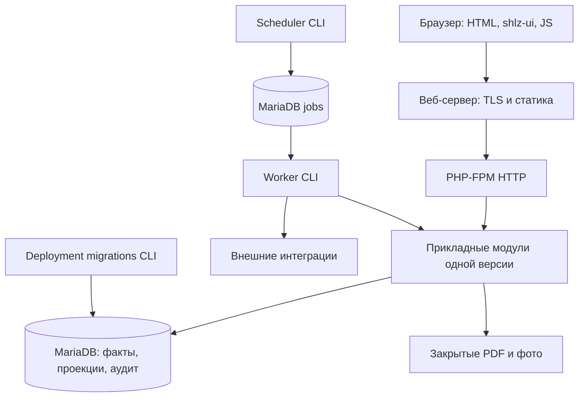

# Модульный монолит и атомарная публикация расчёта ОТиЗ

Решение о направлении и первом переносе принято по поручению владельца2026-09-08
(#32 → первый срез #24 → #33). Реализация и Gate approvals этим ADR не утверждены.
Основание: аудиты [2026-09-07](../architecture/audit-and-target-2026-09-07.md) и
[2026-09-08](../architecture/fmonitor-2-architecture-audit-2026-09-08.md).
Точки ОТиЗ повторно просмотрены на HEAD `b9b77e0da55c8089e9d7412492e4eb3768903c04`;
реальные данные и runtime не исследовались и не менялись.

## Принятые решения

Оставляем PHP-монолит, MariaDB, серверный HTML и публичный shlz-ui. Предметные
модули имеют небольшой прикладной интерфейс, скрывающий авторизацию, правила,
транзакцию и аудит. HTTP/CLI передают команду и отображают результат. Read models
могут делать JOIN через таблицы модулей; запись принадлежит одному владельцу факта.
Межмодульное изменение вызывает операцию владельца и явно согласованный unit of
work; произвольная запись в чужую таблицу запрещена. История append-only, текущие
проекции допустимы; полного event sourcing не вводим.

Слои внутри модуля: прикладные операции → предметные правила; адаптеры БД/файлов/
внешних систем подключаются в composition root. Предметные правила не зависят от
HTTP, окружения, HTML или `rapid-pilot`. Не создаём интерфейс на каждую SQL-команду
и не переносим каталоги без изменения ответственности.

## Процессы и конфигурация

#33 реализует PHP-FPM с веб-сервером, прямой DB host/port и валидируемую явную
конфигурацию. Web/worker/scheduler собираются из одного exact source; секреты
подаются извне, assets собираются в образе, постоянные данные отделены от образа.
Миграции — отдельная команда с блокировкой конкурентного запуска. Обычный HTTP
и worker не имеют DDL и не выводят конфигурацию из demo manifest/generation.
Конкретный веб-сервер, UID/GID и лимиты FPM — проверяемые параметры #33, не
утверждение о текущем стенде. Права должны сохранять доступ к существующим файлам.

Для будущих jobs принимаем MariaDB-очередь: lease, ограниченные повторы, durable
результат и deduplication. Outbox-намерение сохраняется в транзакции предметного
действия, внешняя отправка происходит после commit. Это направление будущего
среза, а не требование реализовать очередь в #24. Брокер потребуется только при
измеренной необходимости. Для email абсолютное exactly-once не обещается.

## Владельцы данных и транзакций

Целевая карта не утверждает, что весь текущий код уже следует ей.

| Модуль / текущие каталоги | Владеет записью | Прикладная транзакция и чтение соседей |
|---|---|---|
| Монтажное дело / InstallationProcess | opening, даты дела, process tasks/events, проекции состояния | Открытие: lock дела, проверка применённого состава/оригинала, opening и снимок checklist/следующие задачи вместе; совместимая legacy-проекция в том же unit of work |
| Распоряжение / AssignmentOrderComposition | версии состава, применения, интервалы назначений | Одна команда применения сериализуется по делу; читает original и кадровые факты, не переписывает инспекционную историю |
| Оригинал / AssignmentOrderOriginal | immutable revisions, metadata, operation receipts и original audit | Одна загрузка/коррекция — одна история и replay result; закрытые bytes подготавливаются вне DB commit, существующий протокол восстановления сохраняется |
| Инспекции / InspectionEvidence | checklist completion facts, attribution, photo metadata/revocations | Одна команда с expected revision: факт и audit вместе; читает opening/назначения; bytes живут в закрытом storage |
| Завершение / текущий InstallationProcess | акт ПТО, декларация, исправления и их аудит | Каждая запись/коррекция под lock дела с обновлением текущей проекции; основание 15% читается ОТиЗ, не создаётся им |
| ОТиЗ / целевой app/Otiz | snapshots, objects, allocations, issues, evidence, publication receipts; впоследствии closures/reversals | Построение публикует весь draft одной транзакцией; принятие — отдельная транзакция по snapshot; будущие выплаты сериализуются по финансовому основанию объекта через все срезы |
| Доступ / IdentityAccess | пользователи, credentials, grants, session version, security audit | Изменение доступа и аудит атомарны; процессный модуль повторно проверяет полномочие команды, не доверяет видимости кнопки |
| Кадры / Workforce | текущий каталог и история импортированных кадровых фактов | Публикация полного кадрового снимка; состав читает каталог и сохраняет собственный снимок, кадровый refresh не переписывает документы |
| Внешние доказательства / временный legacy-migration | provenance, quarantine и решения сопоставления | Импорт/решение через своего владельца; runtime чтение без DDL; данные legacy не становятся подтверждёнными native facts без основания |
| Планирование / временный PilotHttp | планы инспекций и история изменений | Целевой отдельный прикладной владелец; сейчас есть HTTP DML, это следующий самостоятельный перенос |

ОТиЗ не пишет opening, состав, выполнение checklist, кадровые данные или закрытие
документов. Текущие read models могут читать их напрямую через ограниченный
read adapter; воспроизводимый расчёт сохраняет использованные входы и версию правил.
Платёжная фиксация не равна публикации или принятию расчёта.

## Действующие входы и временные адаптеры

Карта проверена чтением исходников, не новой проверкой развёрнутого runtime.

| Вход | Текущий маршрут/владелец | Условие замены |
|---|---|---|
| `public/router.php` | Native `PilotHttpEntrypoint`, без прямого dispatch ОТиЗ | Не назначать единственным router до сохранения всех composite routes |
| `rapid-pilot/router.php` | LocalAuth, assets; прямой dispatch users/status, queue, schedule, completion, calendar, ОТиЗ; затем native fallback | Сохранить dispatch и HTML decorators при постепенном переносе |
| `ProductionPilotHttpEntrypointFactory` | PilotE2ECoordinator → FreshOrderHttpCoordinator → ExecutionHttpCoordinator; composition/original/opening/inspection application owners | Развязать session composition от `rapid-pilot/LocalAuth.php` отдельным срезом |
| `RapidPilotOtiz` | Все `/pilot/otiz/**`, чтение и POST calculate/accept/closures/payments/reverse/reconciliation | В первом срезе только calculate/accept через app/Otiz; остальные записи — явно оставшийся долг |
| `rapid-pilot/docker-entrypoint.sh` → `start.php` | Миграция/bootstrap на старте, socat DB/HTTP, CLI server с rapid router | #33: отдельная миграция, прямой DB, production HTTP при сохранении маршрутов |
| `rapid-pilot/workforce-worker.sh` | Конфигурация из pilot manifest; CLI синхронизация Workforce | #33: явная конфигурация и проверка свежести успешной работы |
| `bin/fmonitor2-migrate.php` | ProductionPilotMigrationCatalogue / CanonicalMigrationApplication | Единственный штатный deployment entrypoint для схемы |
| `bin/fmonitor2-import-cases.php`, `fmonitor2-import-pilot-snapshot.php` | Явные import applications | Сохранять отдельные разрешения; импорт не становится частью HTTP/startup |
| `bin/fmonitor2-sync-workforce.php` | Workforce synchronization | Общая версия кода и прямое подключение к БД |
| `bin/fmonitor2-pilot-demo.php` | Demo generation/bootstrap | Не является источником production configuration |

Читаемые выборки очереди, filters/pagination и карточки сейчас проходят разные
ветви rapid/native. Первый ОТиЗ-срез не унифицирует их и не меняет фильтры.
UserAccessView, ObjectDetails, CompletionFlow, InspectionSchedule и Shell остаются
адаптерами декорирования HTML. Их removal требует собственной проверки реальных
маршрутов, а не одного успешного ответа native router.

## Первый перенос и удаляемый код

`OTIZ-SNAPSHOT-PUBLICATION-001`: HTTP «Подготовить расчёт» вызывает одну операцию
`Otiz\SnapshotPublication::buildAndPublish(actor, reportDate, operationId)`.
Публикация означает доступность полностью построенного **черновика**. Команда
принятия остаётся явной; её persistence и проверка завершённости также принадлежат
модулю ОТиЗ. Пользователь не обязан вызывать build/addRows/finalize по порядку.

Транзакция включает согласованное чтение входов, строки расчёта, итоги,
publication receipt и `draft_calculated`. До commit черновик невидим другим
соединениям. Принятие блокирует snapshot, проверяет publication receipt и полноту,
затем записывает accepted fields и событие в одной транзакции. Hash `pending`
и отсутствие подтверждения публикации никогда не разрешают принятие.

| Сейчас в rapid-pilot/Otiz.php | После среза |
|---|---|
| `calculate()` целиком: выбор прошлого среза, входы, формулы, циклы INSERT, totals/hash/event | Удалён; поведение скрыто за `buildAndPublish` |
| `closedBefore()`, `closureEvidence()`, `issue()` (используются расчётом) | Удалены; чтение оснований и сохранение issues внутри ОТиЗ |
| SQL/транзакция ветки `/snapshots/{id}/accept` | Удалены; HTTP только вызывает операцию принятия и отображает причину |
| `event()` для build/accept | Вызовы удалены; helper пока остаётся для явно отложенных closures/payments/reverse |
| constructor `decisionLedger->ensureSchema()`, `quarantineLedger->ensureSchema()` и транзитивный DDL | Удалены из HTTP; схема подготовлена каноническими миграциями, runtime делает readiness/read |
| HTML, навигация, XLSX и остальные действия | Остаются временным адаптером; отдельные последующие срезы |

Собственный `RapidPilotOtiz::ensureSchema()` уже вызывает только readiness assertion.
Канонические миграции для двух decision ledgers пока отсутствуют: создать и
зарегистрировать их, используя существующие planning/evidence; также проверить
projection tables и `rebuildDecisionState()` на транзитивный runtime DDL.

`NativeOperationalPremiumInputs` и `PremiumCalculation` используются как oracle;
runtime-реализация нужных расчёту частей переносится под `app/Otiz`. Для оставшихся
legacy/verify callers допустима тонкая совместимая обёртка без второй копии правил.
Нельзя скрыть прежний `calculate()` за forwarder и объявить перенос завершённым.

## Приёмка перехода

1. Исполняемый RED A01 через текущий HTTP: сбой после создания header оставляет
   результат, который удаётся принять. Это ещё НЕ выполнено; статический аудит
   не заменяет RED. Затем focused тесты новой операции покрывают сбой после
   первого объекта и перед публикацией, rollback, concurrent visibility и replay.
2. Старый partial draft отвергается; полноценный новый draft доступен для проверки
   и принятия; принятые исторические данные остаются неизменными.
3. Сохранены текущие UI/роли/формулы и маршрут calculate → snapshot → accept → export;
   нет DDL обычного запроса; удаление из таблицы выше подтверждено diff/checker.
4. Независимые test/code reviews, focused GREEN и полный CI на кандидате по
   принятой матрице. Исторические gates не переутверждаются этим документом.

## Альтернативы, гипотезы и отложенные вопросы

- Микросервисы вместо монолита увеличат координацию транзакций и эксплуатации;
  подтверждённой необходимости в независимом масштабировании пока нет.
- Полная SPA вместо HTML расширит миграцию UI. Оставляем HTML/shlz-ui; Vue на одном
  сложном экране — будущая проверяемая гипотеза, не обязательство.
- `building → ready` с фоновой сборкой полезно для долгого расчёта, но сейчас
  добавляет job lifecycle. Выбрана одна транзакция без глобальной блокировки;
  её длительность измеряется на focused fixture. Если обычный расчёт слишком
  долог для HTTP, меняется дизайн публикации отдельным решением, не гарантия полноты.
- A02 (выплаты между срезами) и A03 (остаток округления) остаются открытыми рисками.
  Первый срез не сертифицирует суммы/выплаты. Подтверждённый риск реальных данных
  может прервать порядок по последнему решению владельца.
- Уже accepted история не пересчитывается. Legacy drafts без доказанной публикации
  остаются читаемыми, но требуют нового расчёта перед принятием; никакой массовой
  очистки или назначения им фиктивного признака завершённости.

Следующий этап после этого законченного среза — #33. #38 и прочие неблокирующие
замечания не являются зависимостями архитектурного перехода.
