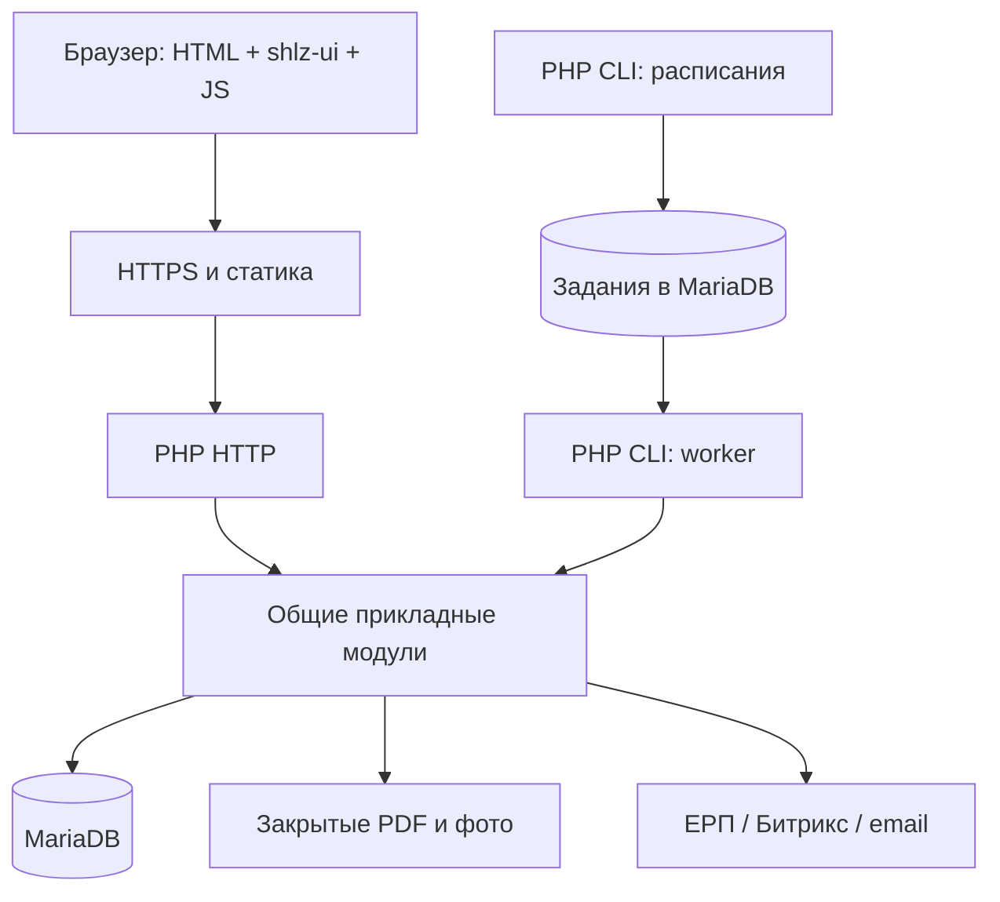

# Архитектурный аудит и направление развития — 2026-09-07

Статус: результат аудита и предложение для будущей реализации, не принятое ADR и не свидетельство production readiness. Эпик: https://github.com/Antropophag/fmonitor-2/issues/18.

## Область и ограничения

Проверены исходники, Dockerfile/Compose, запуск, кадровый worker, HTTP composition, ОТиЗ, оригиналы, JS чек-листа и архитектурные правила. Основа снимка — HEAD `795ac3e` с незакоммиченными изменениями текущей стабилизации; это аудит рабочего дерева, а не только чистого commit. Стенд, нагрузка и полный make verify в рамках аудита не перепроверялись. `tools/architecture/check` завершился `ARCHITECTURE CHECK PASSED (7 rules)`: это отсутствие регрессии относительно baseline, а не отсутствие долга. Более поздние результаты стабилизации должны проверяться отдельно.

## Вывод

Для FMonitor рекомендуется модульный PHP-монолит со слоями внутри предметных модулей, серверным HTML, shlz-ui, организованным клиентским JS, MariaDB и отдельными фоновыми процессами из общего кода. Масштаб в десятки тысяч объектов сам по себе не обосновывает микросервисы, отдельный frontend runtime или брокер сообщений. Нужны измерения запросов и фоновой нагрузки.

## Сильные стороны

- Уже выделены оригиналы, состав распоряжения, инспекционные доказательства, пользователи и кадровый каталог.
- Прикладные команды проверяют полномочия, сохраняют историю и поддерживают идемпотентность. Пример: `app/AssignmentOrderOriginal/AssignmentOrderOriginalService.php`.
- Закрытое хранение документов отделено от публичной статики.
- Compose уже содержит приложение, MariaDB и кадровый worker из общего образа.
- Клиент чек-листа уже имеет основу локального сохранения и синхронизации при нестабильной связи.

## Находки и последствия

| Находка | Свидетельство | Последствие и направление |
|---|---|---|
| Основное приложение зависит от временного пилота | `rapid-pilot/router.php`, `app/PilotHttp/ProductionPilotHttpEntrypointFactory.php`, обращение к `rapid-pilot/LocalAuth.php` | Единая HTTP composition и явные прикладные владельцы; постепенно убрать обязательность pilot runtime |
| Смешение HTTP, SQL, расчётов, экспорта и HTML ОТиЗ | `rapid-pilot/Otiz.php`, 588 строк на момент аудита | Выделить прикладной модуль ОТиЗ, запросы чтения и представления без изменения формул |
| Код миграции исполняется в обычном запросе | Конструктор ОТиЗ вызывает `MigratedEvidenceDecisionLedger::ensureSchema` и `MigrationQuarantineDecisionLedger::ensureSchema`; в них CREATE TABLE | Перенести DDL в миграции; отделить необходимые runtime readers от migration tooling. Собственный bootstrap ОТиЗ уже проверяет readiness — не приписывать ему оставшийся DDL |
| Запуск зависит от демонстрационных механизмов | `rapid-pilot/docker-entrypoint.sh`: socat и bootstrap; `rapid-pilot/start.php`: php -S, четыре CLI workers | Production HTTP-runtime, прямое подключение к БД и явная конфигурация |
| Worker связан с manifest пилота и слабой проверкой состояния | `rapid-pilot/workforce-worker.sh`, Compose healthcheck через существование ready-файла | Независимая конфигурация, контроль свежести успешного выполнения и ошибок; снять необоснованный root runtime |
| Высокая раздробленность и одновременно плотный код | 130 PHP-файлов Original, 123 Composition; Runtime имеет строки до 1884 символов | Число файлов не доказательство дефекта; проверить глубину интерфейсов и убрать бесполезные цепочки. Нормальное форматирование вместо соблюдения потолка строк сжатием |
| Frontend смешивает состояние, DOM и синхронизацию | `app/PilotHttp/checklist.js`: одна строка около 19 тыс. символов; отдельный читаемый исходник не обнаружен | Разделить исходники модели, storage, sync и представления; минификация только в сборке |

Архитектурный checker исключает migration tooling, но часть этого кода вызывается runtime. Проверку следует строить с учётом фактических зависимостей. Baseline и исторические evidence нельзя переписывать ради GREEN.

## Целевая топология

Бэкенд, worker и scheduler используют одну версию приложения и разные команды запуска. Worker вызывает прикладные операции напрямую, не собственный HTTP API. Планировщик может быть короткой командой cron; отдельный постоянно работающий контейнер необязателен. Frontend-ресурсы собираются при сборке, отдельный Node runtime не нужен. Рекомендованный production HTTP-вариант — веб-сервер с PHP-FPM; конкретный выбор фиксируется в ADR при реализации.

Миграции выполняются отдельным deployment step с защитой от одновременного запуска. БД и файлы находятся в постоянных хранилищах с согласованным восстановлением. HTTP, worker и scheduler имеют отдельные проверки состояния. Конфигурация и секреты не выводятся из служебных manifest демонстрации.

## Внутренняя структура

Кандидаты в предметные модули: монтажное дело и распоряжения; инспекции; завершение и документы; ОТиЗ; пользователи и полномочия; кадровые и внешние данные; уведомления. Конкретное объединение существующих каталогов проверить по сценариям, не переносить файлы только ради новой структуры.

Внутри модулей: HTTP/CLI → прикладные операции → предметные правила; SQL, файлы и внешние вызовы — адаптеры. Одна БД допустима, у изменяемого факта один владелец. Специализированные SQL read models с JOIN допустимы для списков/отчётов: не требуется загружать предметные объекты для каждой строки. Межмодульные записи выполняются через owning операции, транзакционные границы явны. Полное event sourcing не требуется: достаточно действующих текущих проекций и append-only истории.

## Фоновые задачи

Начальная рекомендация — очередь в MariaDB, если измерения не выявят иных требований. Нужны сохранённые задания, время следующей попытки, ограниченное закрепление за worker, восстановление после остановки, ключ дедупликации, журнал результата и управляемые повторы. Scheduler лишь ставит задания и учитывает Europe/Moscow для бизнес-расписаний.

Намерение отправки событийного email сохраняется атомарно с предметным изменением (outbox). Внешний вызов выполняется после commit. Абсолютное exactly-once для email не обещать: сбой после принятия письма провайдером, но до записи результата требует отдельной политики; использовать возможности идемпотентности транспорта, если они есть. Обрабатывать HTTP-команды повторно ради повтора письма нельзя.

## Frontend: vanilla или framework

Списки, формы, карточки, документы и простые дашборды могут оставаться серверным HTML с небольшими JS-модулями. Обязателен читаемый source, сборка ресурсов и отделение состояния от DOM.

Чек-лист: выделить модель состояния, локальное storage, очередь/sync и представление. Затем на одном сложном экране сравнить vanilla и точечный Vue по сложности кода, сохранности offline/replay, тестируемости, размеру ресурсов и совместимости с публичными компонентами shlz-ui. Vue — кандидат, не принятое решение и не обязательная миграция в SPA. Календарь оценивать по реальным взаимодействиям. UI остаётся строго shlz-ui; framework управляет состоянием, не заменяет дизайн-систему.

## Порядок перехода и приёмка

1. Проверенный исходный вариант текущей стабилизации и воспроизводимый clean build.
2. Карта владельцев и ADR: процессы, конфигурация, миграции, storage и роль frontend.
3. Production запуск и восстановление в отдельном контуре.
4. Поэтапное устранение runtime-зависимостей rapid-pilot, начиная с выбранного маршрута; ОТиЗ — отдельный существенный этап.
5. Общие jobs/outbox/scheduler до включения рассылок и регулярных интеграций.
6. Читаемый модульный JS, затем решение о framework по ограниченному сравнению.
7. Нагрузочные измерения, актуальные инструкции, полный make verify на exact SHA и deployment/restart proof перед заявлением production integration.

На каждом этапе сохраняются доступы, предметные инварианты, история, документы и текущий UI. Старый путь удаляется после проверки заменяющего. Успешные focused проверки не заменяют итоговый release gate; не запускать полную миграцию ради текущего manual-pilot milestone. Новые slices следуют OpenSpec и действующему процессу с независимым review.

## Источники

- `docs/operations/current-delivery-goal.md`, `docs/operations/restart-handoff-stabilization-2026-09-07.md` — контекст доставки; записанные результаты не являются новой проверкой runtime.
- `docs/architecture/guardrails.md` — baseline и действующие ограничения.
- PHP: встроенный сервер предназначен для разработки/демонстраций, не production: https://www.php.net/manual/en/features.commandline.webserver.php.
- Vue поддерживает постепенное внедрение в серверный HTML: https://vuejs.org/guide/extras/ways-of-using-vue.html.

Аудит сохранён целиком также в GitHub-эпике для доступа до публикации локального документа в git. Декомпозиция и актуальный прогресс ведутся в эпике; этот файл сохраняет исходный результат аудита.
